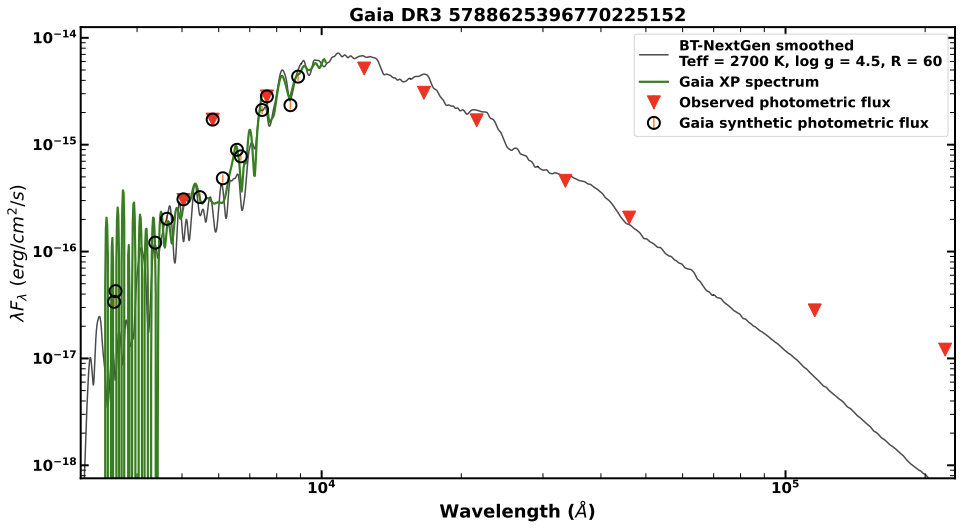

# gaia-sed-toolkit

[](https://github.com/arunroyon/gaia-sed-toolkit/actions/workflows/tests.yml)
[](https://github.com/arunroyon/gaia-sed-toolkit/actions/workflows/lint.yml)
[](https://github.com/arunroyon/gaia-sed-toolkit/actions/workflows/build.yml)

`gaia-sed-toolkit` packages the Gaia DR3 single-source SED workflow in this repository into a reusable Python library and CLI. It supports Gaia XP download, observed photometry lookup, Gaia synthetic photometry generation, BT-NextGen model matching, spectrum scaling, and publication-style plotting.

The repository is organized for both research use and open-source distribution. Library code lives in `src/general_sed`, legacy material is retained in `legacy/`, example assets are separated from generated outputs, and the package is installable with standard Python packaging tools.

## Features

- Installable with `pip install .` and `pip install "git+https://github.com/arunroyon/gaia-sed-toolkit.git"`
- Clean import API for Python users
- CLI for local photometry fitting and full Gaia DR3 single-source runs
- Bundled BT-NextGen synthetic photometry grid for installable offline model matching
- Repository-local discovery of the larger BT-NextGen spectral grid
- Offline smoke tests for import, model parsing, and photometry-to-model fitting

## Installation

### From a local checkout

```bash
pip install .
```

### From GitHub

```bash
pip install "git+https://github.com/arunroyon/gaia-sed-toolkit.git"
```

### Development install

```bash
pip install -e ".[dev]"
```

## Quickstart

Copy-paste example:

```python
from pathlib import Path

from general_sed import fit_photometry

fit = fit_photometry(
    Path("data/examples/temp_sed_products/synthetic_5788625396770225152.csv")
)

print(fit["teff"], fit["logg"], fit["norm_band"])
```

## After install

### Works immediately

- Import the package from Python
- Run offline BT-NextGen photometric fitting with the bundled synthetic-photometry grid
- Use the CLI for `fit-photometry` and `show-paths`

### Requires external full BT-NextGen spectra

- Full SED plotting with BT-NextGen spectra
- The online `run-source` workflow when you want the model spectrum plotted together with Gaia XP and photometry

### Where to place or configure full spectral files

The package looks for the BT-NextGen full spectral grid in this order:

1. `model_spec_dir=` passed to the API or CLI
2. `GENERAL_SED_MODEL_SPEC_DIR` environment variable
3. `data/models/bt-nextgen-agss2009/` inside a repository checkout

Recommended repository-local layout:

```text
data/models/bt-nextgen-agss2009/
```

### CLI usage

Inspect available data paths:

```bash
gaia-sed-toolkit show-paths
```

Fit a local photometry file:

```bash
gaia-sed-toolkit fit-photometry data/examples/temp_sed_products/synthetic_5788625396770225152.csv
```

Run the full single-source pipeline:

```bash
gaia-sed-toolkit run-source 5788625396770225152 --av 0.0
```

## Example output

Example SED output for Gaia DR3 source `5788625396770225152`, combining photometry, Gaia XP, and the matched BT-NextGen model.



[Original PDF output](outputs/fig/5788625396770225152_SED.pdf)

## Inputs and outputs

### Inputs

- Gaia DR3 source ID for the online single-source pipeline
- Optional extinction value `A_V`
- BT-NextGen model directories when running outside a repository checkout
- Local photometry CSV for offline fitting workflows

### Outputs

- Observed photometry CSV
- Gaia synthetic photometry CSV
- SED plot PDF
- Fit metadata including `Teff`, `log g`, normalization band, and scale factor

## Package structure

```text
src/general_sed/          Installable package
tests/                    Offline smoke and functional tests
examples/                 Example scripts
data/examples/            Example FITS and CSV assets
data/models/              External BT-NextGen spectral grid
notebooks/                Original and exploratory notebooks
legacy/                   Legacy pre-package script
outputs/                  Generated figures and transient products
```

Notebook example:

- [`notebooks/test_case.ipynb`](notebooks/test_case.ipynb) runs the reference source `5788625396770225152` with `A_V = 0.0` and `norm_band = "zmag"`.

## Scientific notes

- Wavelengths are handled in Angstrom.
- Flux conversion uses `lambda * F_lambda` in cgs-style units following the original project logic.
- Extinction handling uses `dust_extinction.parameter_averages.CCM89`.
- Model smoothing approximates constant resolving power in log-wavelength space.

## Development

```bash
pip install -e ".[dev]"
pytest
ruff check .
python -m build
```

See [`CONTRIBUTING.md`](CONTRIBUTING.md) for the full contributor workflow and [`docs/release-checklist.md`](docs/release-checklist.md) for release preparation.

## Citation and attribution

The SED workflow in this repository follows the methodology used in:

- Shridharan, B., Mathew, B., Bhattacharyya, S., Robin, T., Arun, R., Kartha, S. S., Manoj, P., Nidhi, S., Maheshwar, G., Paul, K. T., Narang, M., and Himanshu, T. (2022), *Emission line star catalogues post-Gaia DR3. A validation of Gaia DR3 data using the LAMOST OBA emission catalogue*, A&A, 668, A156. [https://doi.org/10.1051/0004-6361/202244353](https://doi.org/10.1051/0004-6361/202244353)

If this repository contributes to published work, please cite both the software repository and the paper above, along with the astronomical data products it depends on, including Gaia DR3, GaiaXPy, Astroquery, Astropy, and the BT-NextGen model grid.

BibTeX:

```bibtex
@ARTICLE{2022A&A...668A.156S,
       author = {{Shridharan}, B. and {Mathew}, B. and {Bhattacharyya}, S. and {Robin}, T. and {Arun}, R. and {Kartha}, S.~S. and {Manoj}, P. and {Nidhi}, S. and {Maheshwar}, G. and {Paul}, K.~T. and {Narang}, M. and {Himanshu}, T.},
        title = "{Emission line star catalogues post-Gaia DR3. A validation of Gaia DR3 data using the LAMOST OBA emission catalogue}",
      journal = {\aap},
     keywords = {stars: emission-line, Be, catalogs, stars: variables: T Tauri, Herbig Ae/Be, methods: data analysis, techniques: spectroscopic, Astrophysics - Astrophysics of Galaxies, Astrophysics - Solar and Stellar Astrophysics},
         year = 2022,
        month = dec,
       volume = {668},
          eid = {A156},
        pages = {A156},
          doi = {10.1051/0004-6361/202244353},
archivePrefix = {arXiv},
       eprint = {2209.13221},
 primaryClass = {astro-ph.GA},
       adsurl = {https://ui.adsabs.harvard.edu/abs/2022A&A...668A.156S},
      adsnote = {Provided by the SAO/NASA Astrophysics Data System}
}
```

## License

This repository currently uses the MIT License as a practical open-source default. If the original project owner intends a different license, update [`LICENSE`](LICENSE) before the first public release.
